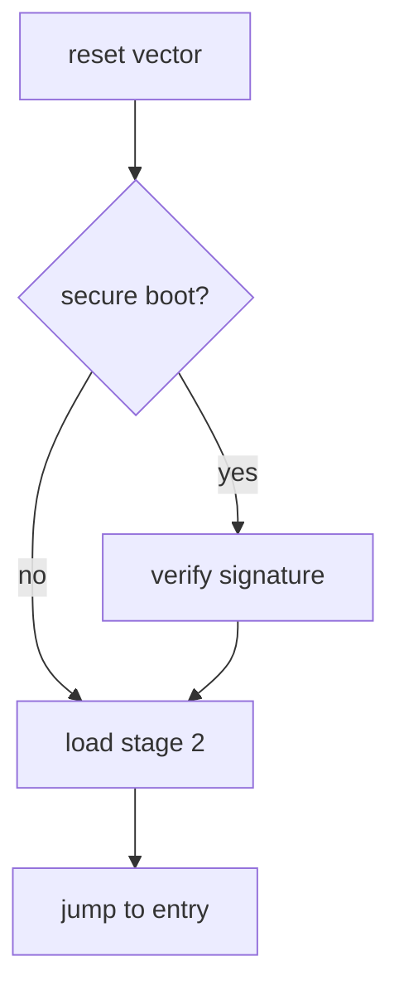

Local render reference. The leading underscore in the filename excludes this
from the content collection, and `draft: true` keeps it out of production —
temporarily rename it to `render-test.md` if you want to preview it.

## Math (KaTeX)

Inline: the mass–energy relation is $E = mc^2$, and Euler's identity is
$e^{i\pi} + 1 = 0$.

Block equation:

$$
\hat{f}(\xi) = \int_{-\infty}^{\infty} f(x)\, e^{-2\pi i x \xi}\,\mathrm{d}x
$$

## Diagram (Mermaid)



## Code

```python
def crc32(data: bytes, poly: int = 0xEDB88320) -> int:
    crc = 0xFFFFFFFF
    for byte in data:
        crc ^= byte
        for _ in range(8):
            crc = (crc >> 1) ^ (poly & -(crc & 1))
    return crc ^ 0xFFFFFFFF
```

```bash
# dump the first 64 bytes of a firmware image
xxd -l 64 firmware.bin | tee header.hex
```

## Code blocks (Expressive Code)

### Titled editor frame + line highlight + line numbers

```js title="src/boot/loader.js" showLineNumbers {3}
export function loadStage2(image) {
  const header = parseHeader(image);
  if (!verifySignature(header)) throw new Error("bad signature");
  return jumpTo(header.entry);
}
```

### Terminal frame

```bash frame="terminal"
objdump -d firmware.elf | head
readelf -h firmware.elf
```

### Diff markers (insert / delete)

```js title="patch.js" del={2} ins={3}
function deriveKey(seed) {
  const key = 0xDEADBEEF;
  const key = sha256(seed).slice(0, 4);
  return key;
}
```

### Collapsible section

```js title="decrypt.js" collapse={2-5}
function decrypt(buf) {
  // boilerplate folded away by default
  const out = new Uint8Array(buf.length);
  for (let i = 0; i < buf.length; i++) {
    out[i] = buf[i] ^ 0x5a;
  }
  return out;
}
```

### Reverse-engineering languages

x86 / NASM-style assembly (bundled `asm`; `nasm` and `x86asm` alias to it):

```asm
_start:
    mov     rax, 1          ; sys_write
    mov     rdi, 1          ; stdout
    lea     rsi, [rel msg]
    mov     rdx, 13
    syscall
```

ARM assembly via the custom grammar (registered as `armasm`, alias `arm`):

```armasm
_start:
    mov     r0, #1          @ stdout
    ldr     r1, =msg        @ buffer
    mov     r2, #13         @ length
    mov     r7, #4          @ sys_write
    svc     #0
```

Hex dump — no reliable Shiki grammar exists, so fall back to a plain `text` fence:

```text
00000000  7f 45 4c 46 02 01 01 00  00 00 00 00 00 00 00 00  |.ELF............|
00000010  02 00 3e 00 01 00 00 00  78 00 40 00 00 00 00 00  |..>.....x.@.....|
```
