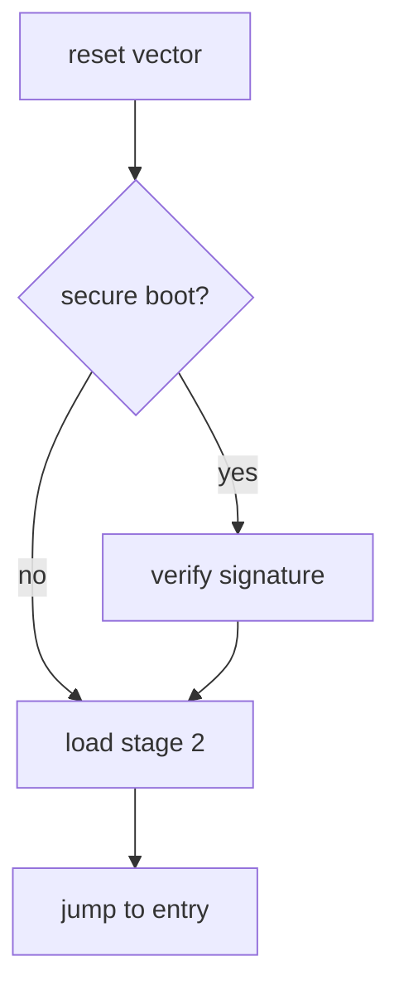

Local render check. This is a temporary published post used to verify the
pipeline; it gets converted to a never-publish draft at the end of setup.

## Math (KaTeX)

Inline: the mass–energy relation is $E = mc^2$, and Euler's identity is
$e^{i\pi} + 1 = 0$.

Block equation:

$$
\hat{f}(\xi) = \int_{-\infty}^{\infty} f(x)\, e^{-2\pi i x \xi}\,\mathrm{d}x
$$

## Diagram (Mermaid)



## Code

```python
def crc32(data: bytes, poly: int = 0xEDB88320) -> int:
    crc = 0xFFFFFFFF
    for byte in data:
        crc ^= byte
        for _ in range(8):
            crc = (crc >> 1) ^ (poly & -(crc & 1))
    return crc ^ 0xFFFFFFFF
```

```bash
# dump the first 64 bytes of a firmware image
xxd -l 64 firmware.bin | tee header.hex
```
